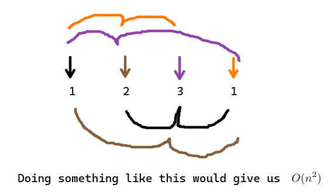

Relevant [neetcode video](https://youtu.be/3OamzN90kPg). 

I think the best we can do is $O(n)$ via the hashtable approach because we must go through each of the element in nums to check for it duplicity.
- The time complexity is $O(n)$ 
- The space complexity is $O(n)$ 

## Takeaways
- hash maps are pretty cool 