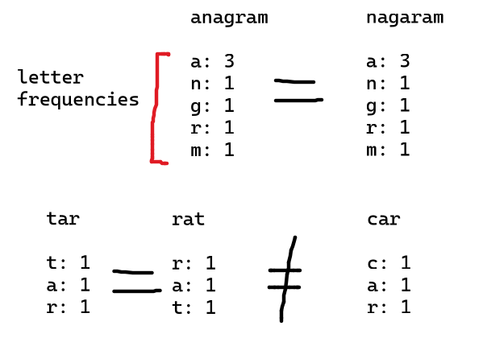
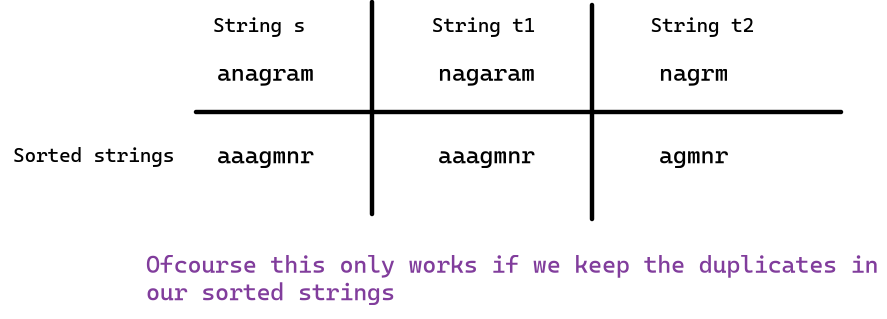
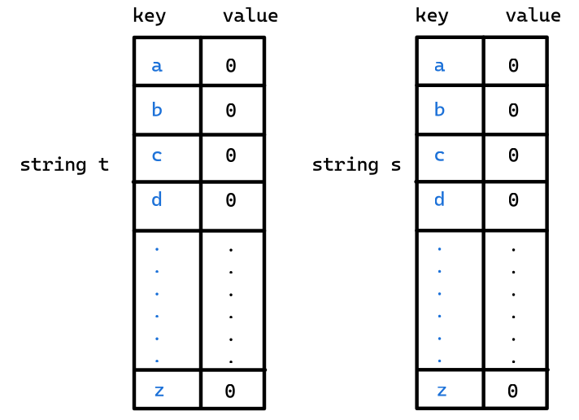
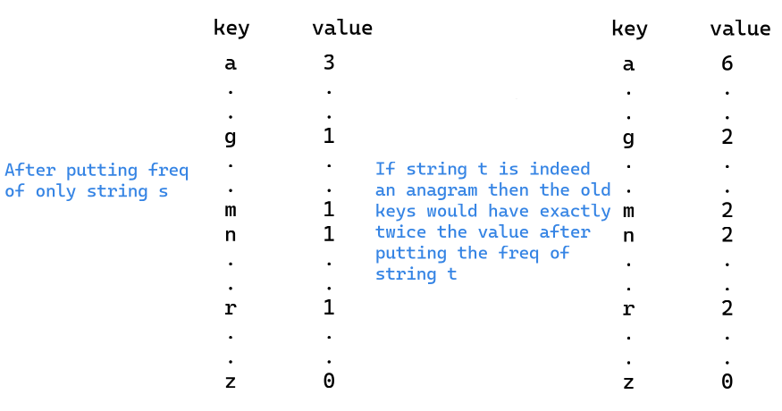

Relevant [neetcode video](https://www.youtube.com/watch?v=9UtInBqnCgA). 

Put the letter frequencies for each of the string into two `std::unordered_map` and then check the two `std::unordered_map` for their equality. 
- The time complexity is $O(3n)=O(n)$ as there are 3 independent loops that depend upon the size of the array
- The space complexity is $O(sizeof(s)+sizeof(t))=O(1)$ refer to https://youtu.be/9UtInBqnCgA?t=261. Since there can only be 26 english alphabets hence the max size of the `std::unordered_map` would also be 26

Other approaches that came to my mind:

1. Sorting the two strings and then comparing the results. 

- Time complexity $O(n\log n)$ 
- Space complexity $O(1)$ if we do destructive sorting, i.e., we do the sorting on the original array hence destroying the orignal one.

### The following two solutions are redundant because I thought the space complexity of the original solution was $O(n)$

2. Since we have the constraint of having only small english alphabets in our arrays. We can exploit this fact and instead of making `std::unordered_map` depending upon the content of the given arrays we can directly make two `std::unordered_map` for each of the 26 english alphabets. Then we can repeat a similar process of counting the frequencies and comparing the two `std::unordered_map` for equivalency.

- Time complexity $O(n)$ 
- Space complexity $O(1)$ if we do destructive sorting

3. We can also eliminate one of the `std::unordered_map` from the `approach#2`

- Time complexity $O(n)$ 
- Space complexity $O(1)$ if we do destructive sorting. Even though we just eliminated one `std::unordered_map`
