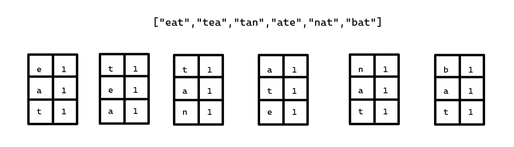
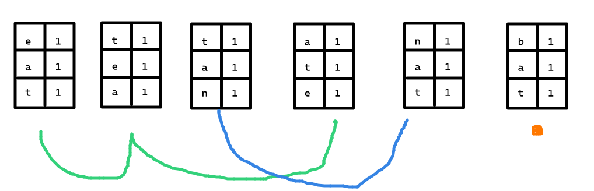
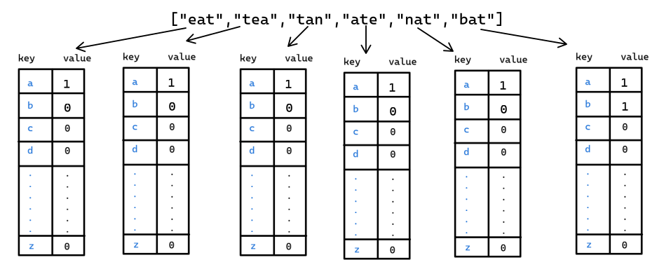
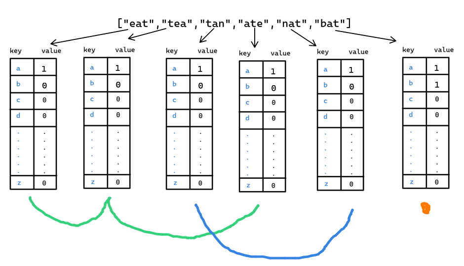
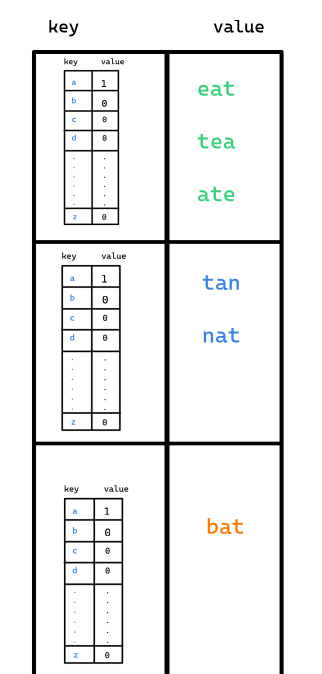

Relevant [neetcode video](https://www.youtube.com/watch?v=vzdNOK2oB2E).

First approach that come to mind:

1. Put each of the string in a hash map

This step would be $O(n*m)$ where:
- $n$ is the number of string
- $m$ is the length of the current string.

2. Then compare each of the hash maps for equality. 

Group the strings according to the indexes of the hashmaps that are equal to each other. This step would be $O(n*n)$. Also the space complexity of this shitty solution is $O(n)$

# Trick used in the [neetcode video](https://www.youtube.com/watch?v=vzdNOK2oB2E):

1. Since we know that the input constraint is small english alphabets. Hence each of the string in the array has a frequency array something like:

2. Now if two string are anagrams then their frequency array would the same:

3. `The real clever thing we can do is use this whole frequency array as the key to the hash map and count the frequencies`:

---

Beware about making something like `unordered_map<vector<int>, vector<string>> m;` because you can't use `int[26]` as the key. So instead use something like `unordered_map<string, vector<string>> m;` and convert the frequency array `int[26]` to string using the `to_string` function.

- Time complexity: $O(n*m*26)$ is for the main loop the result loop is $O(a)$ where $a$ is the number of anagrams in the given input. 

>Hence the time overall complexity is $O(n*m)$ 

- Space complexity: 

1. `map[freq_str];` This is gonna allocate new key only if there is a unique anagram. Linear growth with $a$ where $a$ is the number of unique anagrams in the input. Hence $O(a)$
2. `map[freq_str].push_back(s);` Each original string appears exactly once in exactly one vector. So the map ultimately stores all characters of all strings. Hence $O(n*m)$ where:
- $n$ is the number of string
- $m$ is the length of the current string.

3. `result.push_back(bucket.second);` This is just copying `map[freq_str].push_back(s);` hence this is also just $O(n*m)$

> So overall the space  complexity is $O(n*m)$

# Comparison with the optimal_sol.cpp

1. Used `std::algorithm` to sort the string and used that as the key to the `std::unorderd_map`. Since sorting takes care of the anagrams we can use it as a key.
2. Final step is just a copy to `vector<vector<string>> ans;` which is the same as I did.

# Takeaways

- Using an element's "representation" as a key to itself. 
