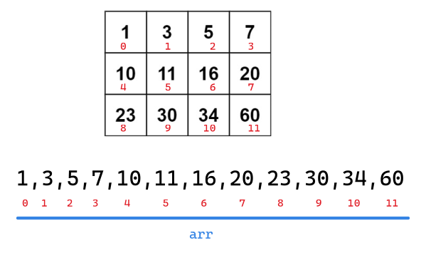
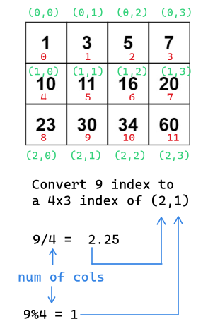

First pay close attention to the given two conditions:

1. Each row is in ascending order
2. The first entry of each row is greater than the last entry of the previous row

This allows us to view the whole 4x3 matrix as a singular array that is sorted in ascending order:

Hence we just perform binary search on `arr`. All we need is to access the 4x3 matrix accordingly to the given linear index of `arr`.

For the conversion of the lienar index to a 4x3 matrix index:

- Time complexity: Binary search is $O(\log_2 a)$ or $O(\lg a)$ Here `n` is the size of the 2D matrix hence $a=mn$ hence $O(\lg mn)$

- Space complexity: $O(1)$ since now addition storage is used that is dependent upon the size of the input.